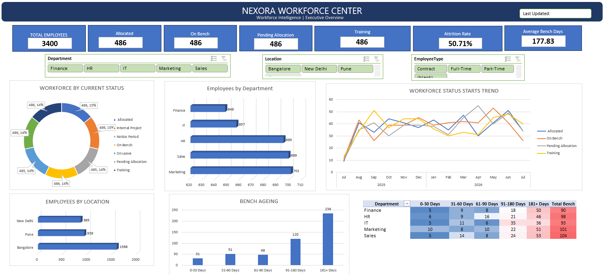

# Excel-Projects
Excel-Projects

A collection of my Excel projects focused on data analysis,
data cleaning, dashboards, visualization, and business insights.

**Projects:**

**1. Store Dataset Analysis**
Store Dashboard provides insights into sales, customer orders, and product performance.
It highlights KPIs like revenue, order count, and category‑wise sales trends.
Visuals include charts, filters, and summaries for quick business analysis.
## Store Dashboard

**2. Taste_And_Trends_Analytics**
Taste & Trends Analytics dashboard provides insights into food ordering patterns across cities and states.
It highlights KPIs like total sales, average rating, and order counts with interactive filters.
Visuals include state‑wise sales maps, performance splits, top restaurants, and monthly sales trends.
## Taste & Trends Analytics Dashboard

### 3. Nexora Workforce Resource & Bench Management Dashboard

🚧 **Work in Progress**

A workforce analytics dashboard built in Microsoft Excel to provide visibility into employee allocation, workforce distribution, bench ageing, and resource planning.

#### Business Objective

The objective of this project is to build a centralized workforce analytics dashboard that helps analyse employee status, allocation, workforce distribution, bench population, bench ageing, and resource availability through interactive Excel dashboards.

#### Tools & Skills Used

- Microsoft Excel
- Excel Tables
- PivotTables
- PivotCharts
- Slicers
- GETPIVOTDATA
- Dynamic KPI calculations
- Conditional Formatting
- Dashboard Design
- Workforce & Resource Analysis

#### Data Used

The project uses employee-level workforce data covering employee details, department, business unit, location, employee type, job role, skills, current status, project information, bench days, bench ageing, training information, and workforce history.

The workbook also includes project-demand data for resource and skill analysis.

#### Dashboard Structure

**1. Executive Overview ✅**

Provides a high-level view of workforce status, department and location distribution, workforce status starts by month, bench ageing, and bench ageing by department.

**2. Workforce Operations — Coming Soon**

Focused on workforce distribution, operational KPIs, employee and project-level analysis, and workforce filtering.

**3. Bench & Resource Risk — Coming Soon**

Focused on bench ageing, long-bench population, skill availability, and project-demand analysis.

#### Current Progress

**Phase 1 — Executive Dashboard ✅**

- Executive workforce KPI cards
- Dynamic KPI calculations
- Interactive Department slicer
- Interactive Location slicer
- Interactive Employee Type slicer
- Workforce by Current Status
- Employees by Department
- Workforce Status Starts Trend
- Employees by Location
- Bench Ageing Analysis
- Bench Ageing by Department Heatmap

#### Key Insights

- The current demo dataset contains **3,400 employee records**.
- **486 employees are currently On Bench**.
- **236 of the 486 current On Bench employees** are in the **181+ days** bench-ageing category.
- Workforce distribution can be analysed by department, location, employee type, and current status.
- Interactive slicers support filtered workforce analysis across the dashboard.

#### Upcoming Work

- Workforce Operations Dashboard
- Employee and Project Detail Analysis
- Bench & Resource Risk Dashboard
- Skill Availability and Project Demand Analysis
- Final dashboard validation and presentation polish
